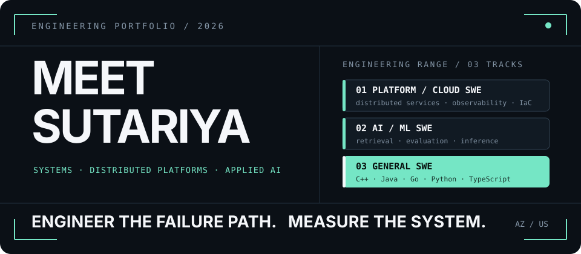
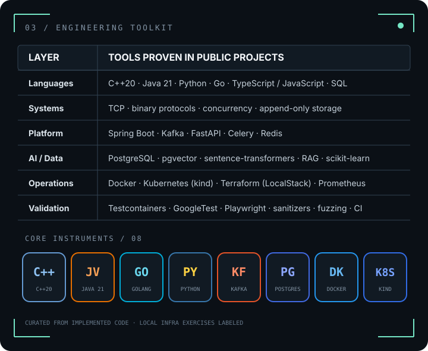
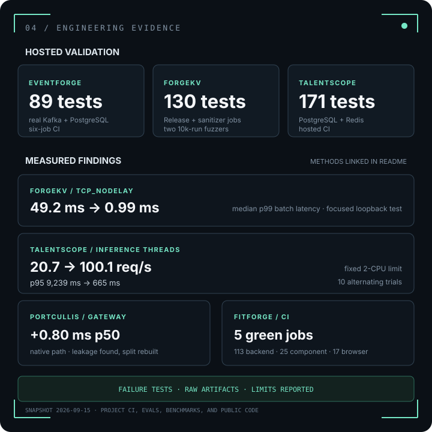

  

  <a href="https://github.com/meetsutariya4448"><strong>GitHub</strong></a>
  &nbsp;&nbsp;·&nbsp;&nbsp;
  <a href="https://www.linkedin.com/in/meetssutariya"><strong>LinkedIn</strong></a>
  &nbsp;&nbsp;·&nbsp;&nbsp;
  <a href="mailto:meetsutariya5930@gmail.com"><strong>Email</strong></a>
  &nbsp;&nbsp;·&nbsp;&nbsp;
  <a href="https://fitforge-six.vercel.app"><strong>Live build</strong></a>

---

## 01 / ENGINEERING PROFILE

I am a Computer Science + Data Science undergraduate at Arizona State University, graduating in 2027. My repositories sit at the intersection of AI/ML software, platform and backend systems, and product engineering: retrieval pipelines, asynchronous workers, protocol gateways, APIs, databases, and deployed interfaces.

I tend to work across the full path: ingest and normalize data, design the database and API boundary, add retrieval or ML where it earns its place, then test and measure the behavior. I am looking for 2027 AI/ML SWE, platform/cloud SWE, backend, and general software engineering internships where that systems-to-product range is useful.

<table>
  <tr>
    <th align="left">AI / ML SOFTWARE</th>
    <th align="left">PLATFORM / CLOUD</th>
    <th align="left">GENERAL SOFTWARE</th>
  </tr>
  <tr>
    <td>Retrieval, embeddings, clustering, RAG, and evaluation harnesses</td>
    <td>APIs, gateways, workers, data stores, containers, CI, metrics, and deployment</td>
    <td>Authentication, relational models, frontend workflows, and shipped products</td>
  </tr>
</table>

---

## 02 / SELECTED SYSTEMS

### 01 · [TalentScope](https://github.com/meetsutariya4448/talentscope)

#### Job-market intelligence from scheduled ingestion to hybrid retrieval.

Celery workers ingest postings from Greenhouse, Lever, and Adzuna, normalize and deduplicate them, and persist searchable records in PostgreSQL. A FastAPI layer combines GIN full-text search with pgvector HNSW retrieval through Reciprocal Rank Fusion; Redis-backed RAG Q&A and scheduled KMeans role clustering sit on the same data path.

`Python · FastAPI · PostgreSQL · pgvector · Celery · Redis · scikit-learn · Docker`

**Role signal:** Platform/cloud SWE · backend engineering · data systems · applied AI/ML

**Engineering signal:** 1,530-posting measured corpus · hybrid search p95 **39.2 ms** across 600 local samples · **54 tests passing** in GitHub Actions.  
[Repository →](https://github.com/meetsutariya4448/talentscope) · [CI →](https://github.com/meetsutariya4448/talentscope/actions/runs/30116435731) · [Benchmark →](https://github.com/meetsutariya4448/talentscope/blob/main/evals/benchmark.json)

 

### 02 · [Portcullis](https://github.com/meetsutariya4448/portcullis)

#### A stateless protocol gateway with a separately evaluated security control plane.

The Go data plane validates MCP headers against JSON-RPC bodies, routes namespaced tools, and bridges legacy upstreams through bounded session pools and a sliding-window circuit breaker. The Python control plane evaluates a three-stage tool-poisoning detector—rules, local embedding similarity, then an LLM classifier with literal evidence-span validation.

`Go · Python · net/http · Prometheus · sentence-transformers · pgvector · Docker`

**Role signal:** Platform SWE · backend engineering · AI infrastructure · security engineering

**Engineering signal:** sourced 139-row scanner corpus · cascade F1 **0.973** under leave-one-out evaluation, with the stricter family-holdout limitation reported alongside it · measured native gateway p50 overhead **+1.30 ms** on the documented local benchmark. The scanner is not yet wired into live gateway enforcement.  
[Repository →](https://github.com/meetsutariya4448/portcullis) · [Architecture →](https://github.com/meetsutariya4448/portcullis/blob/main/ARCHITECTURE.md) · [Evaluation →](https://github.com/meetsutariya4448/portcullis/blob/main/control/evals/REPORT.md)

 

### 03 · [FitForge](https://github.com/meetsutariya4448/fitforge)

#### A deployed fitness product with an evaluated retrieval path.

FitForge pairs a React client with a FastAPI/PostgreSQL backend for JWT-authenticated plan generation, workout-session logging, personal-record updates, and progress visualization. Its planning path retrieves fitness guidance with sparse + dense search and cross-encoder reranking before grounded generation through Groq.

`Python · FastAPI · PostgreSQL · React · Recharts · sentence-transformers · Groq · Docker`

**Role signal:** General SWE · AI/ML SWE · full-stack product engineering

**Engineering signal:** working public deployment · Alembic-managed relational model · 30-query retrieval ablation where hybrid search reached **R@5 0.900**, with dataset bias and generation-judge limits documented in the repository.  
[Live demo →](https://fitforge-six.vercel.app) · [Repository →](https://github.com/meetsutariya4448/fitforge) · [RAG evaluation →](https://github.com/meetsutariya4448/fitforge/blob/main/backend/eval/results.md)

---

## 03 / ENGINEERING TOOLKIT

  

---

## 04 / ENGINEERING EVIDENCE

  

  <a href="https://github.com/meetsutariya4448/talentscope/actions/runs/30116435731"><strong>TalentScope CI</strong></a>
  &nbsp;&nbsp;·&nbsp;&nbsp;
  <a href="https://github.com/meetsutariya4448/portcullis/blob/main/control/evals/REPORT.md"><strong>Portcullis evaluation</strong></a>
  &nbsp;&nbsp;·&nbsp;&nbsp;
  <a href="https://github.com/meetsutariya4448/fitforge/blob/main/backend/eval/results.md"><strong>FitForge RAG evaluation</strong></a>

Activity provides context; project-specific tests, evaluations, and benchmarks remain the stronger signal.

---

## 05 / CURRENT WORKING SET

- **Portcullis:** the explicit next boundary is scanner-to-gateway integration and a real allow/block/log policy layer.
- **FitForge:** the latest work adds the hybrid RAG path and examines where onboarding-derived queries diverge from user intent.
- **TalentScope:** recent hardening made clustering deterministic and benchmark artifacts traceable to a single source of truth.

---

## 06 / CONTACT

If the work involves APIs, data movement, retrieval, platform services, or the path from model output to a reliable product, I would like to hear about it. I am open to relevant **2027 AI/ML SWE, platform/cloud SWE, backend, and general software engineering internships**.

  <a href="https://github.com/meetsutariya4448"><strong>GitHub</strong></a>
  &nbsp;&nbsp;·&nbsp;&nbsp;
  <a href="https://www.linkedin.com/in/meetssutariya"><strong>LinkedIn</strong></a>
  &nbsp;&nbsp;·&nbsp;&nbsp;
  <a href="mailto:meetsutariya5930@gmail.com"><strong>meetsutariya5930@gmail.com</strong></a>

